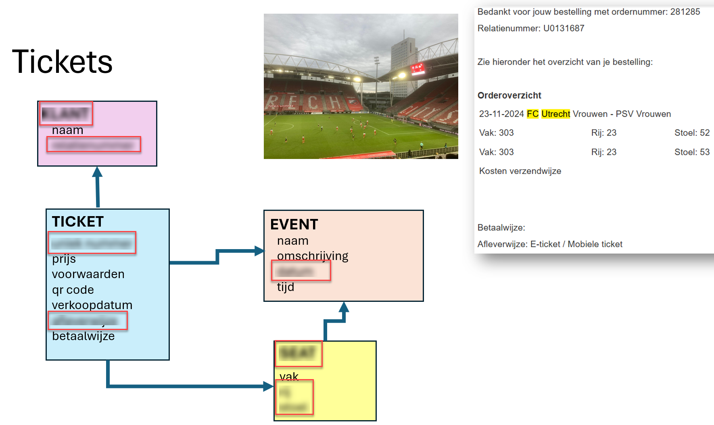
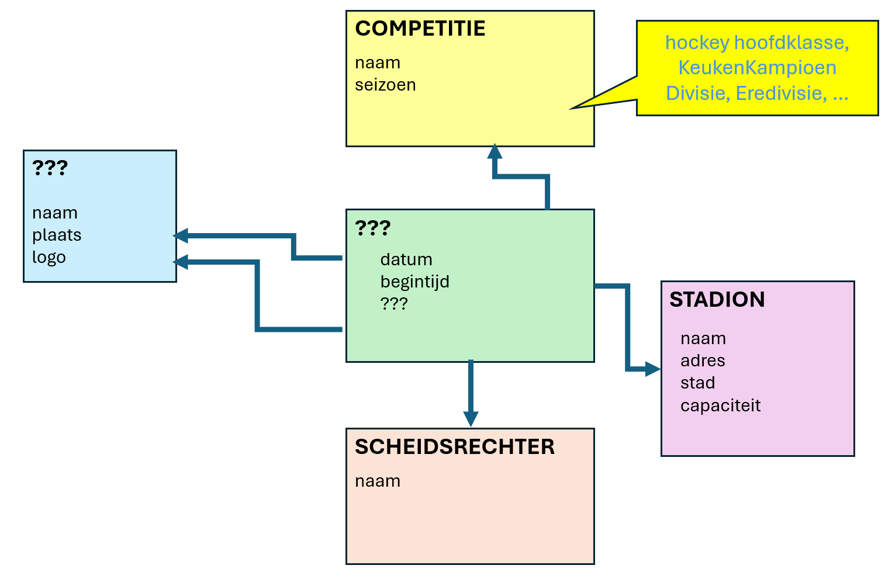
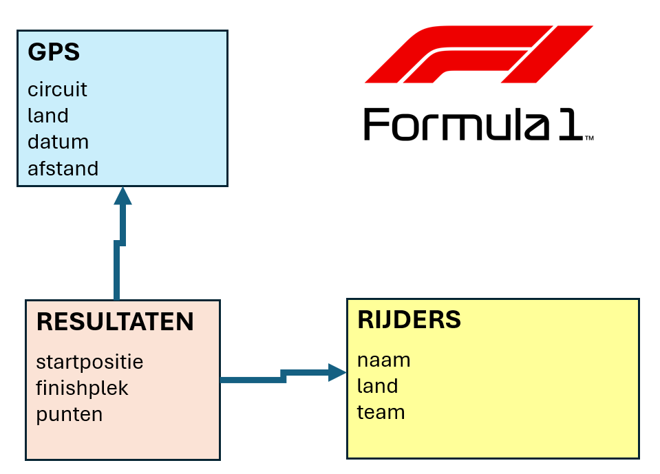
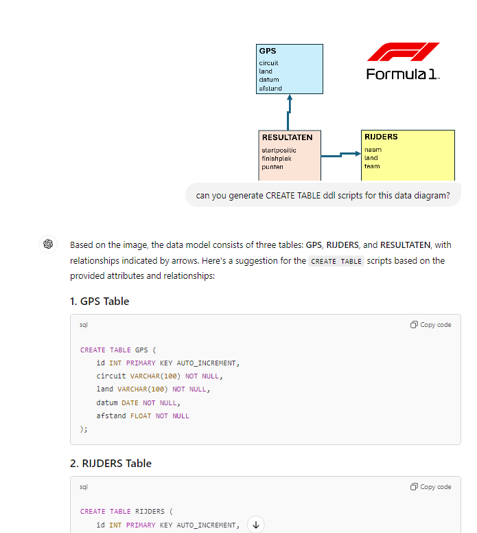
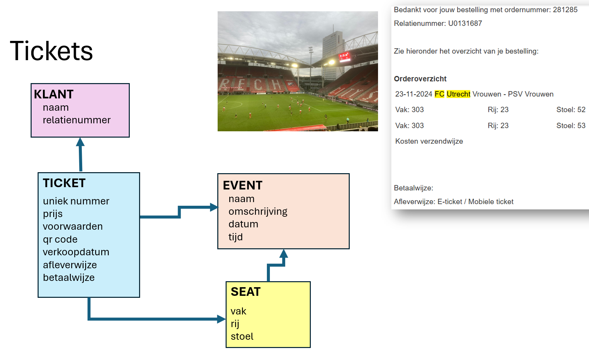

# Data Formaten, Data Modellering, Advanced SQL

- [Data Formaten, Data Modellering, Advanced SQL](#data-formaten-data-modellering-advanced-sql)
  - [Data Analyse](#data-analyse)
  - [File Identificatie](#file-identificatie)
    - [Escape Room Style (Binair Tellen op je vingers)](#escape-room-style-binair-tellen-op-je-vingers)
    - [Nullen en Enen - van karakters, bytes en bits](#nullen-en-enen---van-karakters-bytes-en-bits)
- [Analyseer de Woon-School Reisverkeer Survey](#analyseer-de-woon-school-reisverkeer-survey)
- [Datamodellering](#datamodellering)
  - [Ticket-Shop](#ticket-shop)
  - [Maak een praktijk-datamodel voor de praktijk](#maak-een-praktijk-datamodel-voor-de-praktijk)
  - [Interpreteer en completeer datamodel](#interpreteer-en-completeer-datamodel)
  - [Maak de Create Table scripts voor een data-model](#maak-de-create-table-scripts-voor-een-data-model)
- [Advanced SQL : Scalar Subquery en Common Table Expression (CTE)](#advanced-sql--scalar-subquery-en-common-table-expression-cte)
  - [Run DuckDB en bouw IMDb](#run-duckdb-en-bouw-imdb)
  - [Scalar Subquery](#scalar-subquery)
    - [Common Table Expression](#common-table-expression)
  - [Appendix](#appendix)
    - [Data Modellering Ticketshop](#data-modellering-ticketshop)
    - [Scalar Subquery en Common Table Expression](#scalar-subquery-en-common-table-expression)


## Data Analyse

Weke boodschap is verborgen in deze file: [mysterieus plaatje](files/mysterieus-plaatje.png)?

Tip: Je kunt QR Codes onderzoeken met je telefoon en met QR Code scanning tools. Scan bijvoorbeeld een QR Code uit een file die je uploadt naar: https://scanqr.org/

Je kunt zelf ook QR Code maken met QR Code Generator - van tekst, URL, locatie: https://scanqr.org/qr-code-generator.

Maak een QR Code met een vriendelijke wens voor je klasgenoten. 
Stuur deze QR Code via mail of chat of als foto en zorg dat tenminste klasgenoot de boodschap heeft ontvangen en begrepen.  

## File Identificatie
Een file heeft vaak een extensie - de laatste drie of vier letters, achter de punt. Zoals docx, xlsx, gif, mp4, jpg, mp3, txt. exe. Deze extensie is een aanwijzing aan je operating system wat voor soort file het is en wat voor soort programma de file kan worden geopend.

De extensie is een hint - geen garantie. Een file kan een verkeerde extensie hebben (inhoud en extensie kloppen niet met elkaar) of zelfs geen extensie. Je kunt gebruikmaken van dit tool om ruwe file content te onderzoeken: https://hexed.it/ . In de ruwe contents van de meeste files zit informatie waarmee je zelf kan bedenken wat het formaat is van de fileinhoud en dus ook welke extensie er eigenlijk bij hoort.

Je kan een file naar dit tool uploaden, je ziet de ruwe content en je kan onder menuoptie Tools de optie File Format Identification kijken naar wat voor soort content de file bevat volgens dit tool.

Welk dier zit verscholen in deze file: [uitzoeker.qqq](files/uitzoeker.qqq)

Een iets ingewikkelder puzzel is file [Je kunt hier een dier mee vinden.xxx](files/Je kunt hier een dier mee vinden.xxx). Inspecteer de file. Bepaal de juiste extensie. Open de file met een programma dat het goed kan weergeven. Gebruik de inhoud van programma om een dier te vinden.

Welk getal wordt indirect aangeduid via deze file: [i-love-you-in-sign.png](files/i-love-you-in-sign.png)

### Escape Room Style (Binair Tellen op je vingers)

Puzzel voor in de pauze:

Verzin een getal onder de 1024.
Beeld dat getal uit met je vingers (bijvoorbeeld met hulp van https://en.wikipedia.org/wiki/Finger_binary)
Laat iemand een foto maken van je hand(en) die het getal uitbeelden.
Je kunt de file in Teams plaatsen en een Shareable URL maken. Maak een QR Code van die Shareable URL. Deel de QR Code met klasgenoten.
De eerste klasgenoot die het getal onder de 1024 "raadt" wint de puzzelronde. 

### Nullen en Enen - van karakters, bytes en bits

Bekijk file [nullen-en-enen.txt](files/nullen-en-enen.txt). Wat zie je als inhoud in deze file? Hoe denk je dat deze file op schijf is opgeslagen? Open de file in https://hexed.it/ . Wat zie je als inhoud? Kan je dat verklaren?

Hint: ASCII. Hint 2: 30 in Hexadecimaal = 48 in Decimaal PS: dit is een best ingewikkelde vraag!

# Analyseer de Woon-School Reisverkeer Survey 

De verzamelde resultaten van de survey zijn te vinden in deze file: https://github.com/lucasjellema/informatica-databases/blob/main/survey/survey_results.csv .

Voer onderstaand statement uit om de resultaten van de survey over Woon-School-verkeer vanuit de ruwe data file te bekijken:
```
SELECT * 
FROM   read_csv_auto('https://raw.githubusercontent.com/lucasjellema/informatica-databases/refs/heads/main/survey/survey_results.csv')
;
```

Creëer een tabel om deze ruwe data in je DuckDB database vast te leggen:

```
create table survey_results 
( x1 varchar, x2 varchar, x3 varchar, x4 varchar, x5 varchar, x6 varchar
, voornaam varchar
, woonplaats varchar 
, reisafstand decimal(5,2) -- 5 cijfers, maximaal 2 achter de comma
, reistijd utinyint -- tussen 0 en 255
, vervoermiddel varchar
);
```

en gebruik dit statement om de data uit de csv file rechtstreeks in de tabel te laden:

```
insert into 
survey_results 
SELECT * 
FROM   read_csv('https://raw.githubusercontent.com/lucasjellema/informatica-databases/refs/heads/main/survey/survey_results.csv');
;
```

Analyseer de surveyresultaten en beantwoord de volgende vragen:

* Hoeveel surveys zijn er ingevuld?
* Hoeveel surveys zijn er per woonplaats ingevuld?
* Wat is de gemiddelde reisafstand?
* Wat is de gemiddelde reistijd?
* Wat is de meest genoemde woonplaats? Hint: [mode()](https://duckdb.org/docs/sql/functions/aggregates.html#modex)  
* Welke vervoermiddelen zijn in gebruik? Hoeveel van elk vervoermiddel?
* Wat zijn de top 3 vervoermiddelen?  Hint: `order by` en `limit`
* Wat is de langste reistijd? En wat is de langste reistijd per woonplaats?
* Wat is het aantal surveys voor de meest genoemde woonplaats? 
* Wat is de kortste reisafastand (per vervoermiddel)?

Als voorbeeld van de SQL syntax deze query:

```
select vervoermiddel
,      max(reistijd) as langste_reisafstand
from   survey_results
group
by     vervoermiddel
having count(voornaam) > 2
;
```  
Wat is de langste reistijd per vervoermiddel voor ieder vervoermiddel dat door tenminste drie survey-deelnemers is ingevuld.

# Datamodellering

## Ticket-Shop

Het datamodel voor een online ticket-shop is in de volgende plaat afgebeeld. Er missen een paar kolomnamen en zelfs twee tabelnamen. Wat denk jij dat de missende namen zouden moeten zijn?

Hint: kijk goed naar het screenshot van de bevestigingsemail die de klant heeft ontvangen na het kopen van de tickets.



## Maak een praktijk-datamodel voor de praktijk

Stel je voor. Je tante is huisarts. En ze zou graag een handig computersysteem willen hebben voor haar praktijk. Het maken van afspraken het patiënten is een enorme klus. Dat kan vast handiger.

Ze vertelt je het volgende verhaaltje. Kan je op basis daarvan een ontwerp maken voor de database in haar computersysteem?

"Patiënten bellen om een afspraak te maken. Met de combinatie van naam en geboortedatum worden weten we om welke patiënt het gaat. Ze vertellen kort waar ze voor willen komen. Dan bepalen we direct of het een kort of uitgebreid consult moet zijn. De assistent spreekt een datum en tijd af met de patiënt. Dat moet natuurlijk een moment zijn dat ik nog niet bezet ben met andere afspraken. Soms doen we het consult telefonisch of digitaal - via Zoom. Dat moet natuurlijk goed vastgelegd worden. En heel soms moet ik voor een afspraak bij een patiënt langsgaan. Dan heb ik het adres nodig. Natuurlijk is voor zo'n afspraak veel langer nodig, meestal een vol uur vanwege de reistijd. 

Een patiënt kan bellen om een afspraak af te zeggen of te verplaatsen. Soms komt een patiënt helemaal niet opdagen. Dat houden we bij en als het vaker gebeurt gaan we daar de persoon op aanspreken. Ik maak van ieder consult een kort verslag. Van iedere patiënt heb ik een dossier waarin alle verslagen van alle afspraken zijn terug te vinden. Soms stuur schrijf ik een recept voor de apotheek naar aanleiding van het consult; dan geef ik aan welk medicijn en voor hoe lang dat moet worden gebruikt. Dit moet in het systeem worden vastgelegd zodat ik weet welke medicijnen een patiënt slikt. "

Bonus: stel je voor dat er in de praktijk van je tante nog twee artsen komen te werken. (Hoe) zou het datamodel dan moeten worden aangepast?

## Interpreteer en completeer datamodel
Waar is onderstaand datamodel voor bedoeld? 
Welke twee tabelnamen ontbreken (waar de ???? staan)? Welke kolomnaam stel je voor om te gebruiken in de centrale tabel?



## Maak de Create Table scripts voor een data-model

Hier staat het wat vereenvoudigde model voor Formule 1 races:


Maak de *CREATE TABLE* scripts voor deze tabellen. 

NB: voeg aan iedere tabel een kolom *id* toe voor de primaire sleutel. Voeg ook een kolom toe voor iedere referentie die een tabel heeft naar een andere tabel.

Tip: misschien kan ChatGPT je helpen! Zie onderstaand screenshot voor een voorbeeld.


Als je tijd over hebt zou je nu ook de tabellen kunnen aanmaken in SQLLite of DuckDB en zou je er ook data in kunnen proberen te *insert-en*. 

# Advanced SQL : Scalar Subquery en Common Table Expression (CTE)

Een paar vingeroefeningen met een paar geavanceerde SQL technieken.

## Run DuckDB en bouw IMDb 
 kunt DuckDB eenvoudig draaien via de DuckDB WebShell (om een SQL database in a browser te starten) via deze link: https://shell.duckdb.org/.

Je kunt ook DuckDB eenvoudig installeren. Ga naar [duckdb.org/docs/installation](https://duckdb.org/docs/installation) en download de stable version, Command Line environment voor jouw Platform. De download bevat een executable file (duckdb.exe). Extraheer deze uit het archief en start deze file. 

Als de database is gestart, voer de volgende statements uit om de vier tabellen van de IMDb aan te maken en met data te laden:

```
CREATE TABLE imdb_countries AS
SELECT * FROM   read_csv_auto('https://raw.githubusercontent.com/lucasjellema/informatica-databases/main/imdb/countries.csv');
CREATE TABLE imdb_movies AS
SELECT * FROM read_csv_auto('https://raw.githubusercontent.com/lucasjellema/informatica-databases/main/imdb/movies.csv');
CREATE TABLE imdb_actors AS
SELECT * FROM read_csv_auto('https://raw.githubusercontent.com/lucasjellema/informatica-databases/main/imdb/actors.csv');
CREATE TABLE imdb_roles AS
SELECT * FROM read_csv_auto('https://raw.githubusercontent.com/lucasjellema/informatica-databases/main/imdb/roles.csv');
```

Type 
```
show tables;
```
## Scalar Subquery

Een scalar subquery is een query die precies één ding oplevert. Een string, date of getal. De scalar subquery kan je op diverse plekken in je hoofdquery gebruiken - altijd tussen haakjes - op een plek waar ook een getal of string zou kunnen staan. Je gebruikt de Scalar Subquery als een soort functie-aanroep.

Een voorbeeld: de subquery is `select avg(duration) from   imdb_movies`. Deze geeft de gemiddelde speelduur van alle films. Als we willen weten welke films allemaal langer duren dan de gemiddelde duration kunnen we subquery als volgt gebruiken:

```
select movie.title
,      movie.duration
from   imdb_movies movie
where  movie.duration > ( select avg(duration)
                          from   imdb_movies
                        ) 
```
Zoek nu alle films die meer dan 20% langer zijn dan de gemiddelde duration (oftewel 1.2 keer).

De volgende query geeft voor de langere films ook aan hoeveel langer dan de gemiddelde speelduur ze zijn. De scalar subquery wordt hier twee keer gebruikt, zowel in de SELECT als in de FROM clause.

```
select movie.title
,      movie.duration
,      movie.duration - ( select avg(duration)
                          from   imdb_movies
                        ) bonus_duration
from   imdb_movies movie
where  movie.duration > ( select avg(duration)
                          from   imdb_movies
                        ) 
;
```
De volgende query bevat drie scalar subqueries die elk iets anders doen:

```
select ( select avg(duration)
         from   imdb_movies
         ) avg_duration
,      ( select min(title)
         from   imdb_movies 
       ) first_title
from   imdb_movies movie
where  movie.identifier = (select max(identifier) from imdb_movies)
;
```

create table survey_results 
( x1 varchar, x2 varchar, x3 varchar, x4 varchar, x5 varchar, x6 varchar
, voornaam varchar
, woonplaats varchar 
, reisafstand decimal(5,2) -- 5 cijfers, maximaal 2 achter de comma
, reistijd utinyint -- tussen 0 en 255
, vervoermiddel varchar
);

Deze query zoekt het meest populaire vervoermiddel in tabel *survey_results*. 
```
select vervoermiddel
,      count(voornaam) aantal
from   survey_results
group
by     vervoermiddel
order 
by     count(voornaam) desc
limit  1
```

Pas deze query aan om als scalar subquery te gebruiken in de volgende query. Hierin zoeken we naar de gemiddelde reisafstand van iedereen die het meest populaire vervoermiddel gebruikt:

```
select avg(reisafstand) gemiddelde_reisafstand
from   survey_results
where  vervoermiddel = (<scalar subquery>)
;
```
Hint: een scalar subquery moet precies één waarde teruggeven. In dit geval is die ene waarde de naam van het vervoermiddel.

Wat is deze gemiddelde reisafstand met het meest populaire vervoermiddel (van de fietsers)?

### Common Table Expression

Met het `WITH` statement kunnen we in een SQL query een of meer zogenaamde CTE (Common Table Expression) definiëren. CTE's zijn queries met een naam die een aantal records produceren. In de "hoofdquery" kunnen we de CTE's gebruiken alsof het tabellen zijn. Met CTE's kunnen we queries leesbaarder maken en soms ook kleiner als we meerdere keren dezelfde CTE kunnen gebruiken.

Een voorbeeld waarin de CTE *sf_movies* wordt gedefinieerd - voor alle Science Fiction films. Deze CTE wordt in de hoofdquery gebruikt.

```
with sf_movies as
( select identifier
  ,      title
  ,      duration
  from   imdb_movies
  where  genre = 'Science Fiction' 
)
select title
,      duration
from   sf_movies
order 
by     title
```
Probeer deze query uit te voeren.

De volgende query definieert de CTE *old_movies* en ook de CTE *young_actors*. Vervolgens wordt gezocht naar rollen van young actors in old movies. Met hulp van de twee CTEs levert dit een vrij goed leesbare query op. Dezelfde query als één grote query kan hetzelfde resultaat geven, maar is minder leesbaar. 

```
with old_movies as
( select identifier
  ,      title
  ,      "release year" as year
  from   imdb_movies
  where  year < 2020
)
, young_actors as
( select identifier
  ,      "first name" ||' '||"last name" as name
  ,      "birth date" as birth_date
  from   imdb_actors
  where  birth_date > '1990-01-01'
)
select m.title
,      m.year
,      a.name
,      r.character 
from   imdb_roles r
       join
       old_movies m
       on r.movieId = m.identifier
       join
       young_actors a
       on r.actorId = a.identifier
order 
by     title
```
Probeer deze query uit te voeren.

Ons idee over oude films is veranderd. In plaats van voor 2020 vinden we alle films van voor 2022 al oud. Kan je bovenstaande query zo aanpassen dat we alle rollen te zien krijgen van jonge acteurs in films van voor 2022?

Schrijf een query tegen tabel *SURVEY_RESULTS* om van de inwoners van SOEST te bepalen wat hun gemiddelde reistijd is. Schrijf een CTE *soestenaren* en gebruik die in de hoofdquery. De query ziet er als volgt uit:

```
WITH soestenaren AS
(

)
SELECT AVG(reistijd)
FROM   soestenaren
;
```

Maak nu een query - met CTE - om de kortste reisafstand te bepalen van iedereen die van buiten Soest komt.

## Appendix

Antwoorden op sommige opgaven:

### Data Modellering Ticketshop




### Scalar Subquery en Common Table Expression

select avg(reisafstand) gemiddelde_reisafstand
from   survey_results
where  vervoermiddel = (select vervoermiddel
                        from   survey_results
                        group
                        by     vervoermiddel
                        order 
                        by     count(vervoermiddel) desc
                        limit  1
                       ) 


WITH niet_soestenaren AS
( select *
  from   survey_results
  where  upper(woonplaats) != 'SOEST'
)
SELECT MIN(reisafstand) as kortste_reisafstand
FROM   niet_soestenaren
;