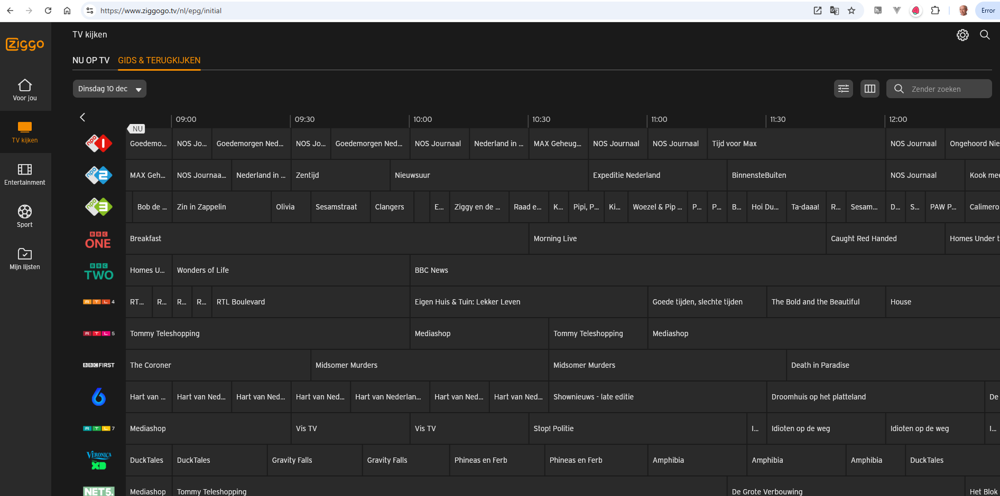

# JSON en NoSQL Database

- [JSON en NoSQL Database](#json-en-nosql-database)
  - [JSON](#json)
    - [JSON in Web Applicaties](#json-in-web-applicaties)
    - [Simpel JSON](#simpel-json)
  - [Zoek in Ziggo Go](#zoek-in-ziggo-go)
    - [JSON communicatie achter Reisplanner](#json-communicatie-achter-reisplanner)
  - [Introductie NoSQL Database MongoDB](#introductie-nosql-database-mongodb)
  - [Query Documenten in MongoDB](#query-documenten-in-mongodb)
    - [Verken landendata](#verken-landendata)
    - [Onderzoek Woon-School Survey Results met MongoDB](#onderzoek-woon-school-survey-results-met-mongodb)
  - [Vergelijk SQL en NoSQL](#vergelijk-sql-en-nosql)
- [Appendix](#appendix)
  - [Hoe krijg je de IMDb data in MongoDB](#hoe-krijg-je-de-imdb-data-in-mongodb)
    - [Achtergrond bij het maken van JSON documenten met SQL](#achtergrond-bij-het-maken-van-json-documenten-met-sql)


## JSON

Kennismaken met data in JSON formaat. Een formaat dat je op heel veel plekken tegenkomt. Onder andere in de uitwisseling van data tussen web applicaties en de web servers.

### JSON in Web Applicaties

In veel web applicaties speelt JSON een belangrijke rol. Data wordt vaak in JSON formaat gedefinieerd in de web applicatie of in JSON format door de web applicatie uit een server (via een API) opgevraagd.

Voor een simpel voorbeeld, kijk naar file `[dieren-app.html](./dieren-app.html)`. Open de file in je browser. Je ziet een lijstje dieren op een web pagina. Als je de inhoud van de file bekijkt dan zie je de definitie van het JSON data object met dier definities.

Download de file naar je computer. Open de file in een text editor. Verander de prijs van Bear van 800 naar 1900. Voeg een Dog object toe:
```
{ name: "Dog", species: "Canis lupus familiaris", price: 300 },
```

Sla de wijzigingen op. Open de file in een browser. Check of de aanpassingen in het data object zichtbaar zijn in de webpagina. 

Bonus:
Je kunt in de Browser Developer Tools naar de tab Console gaan. In de Console kan je de string `animals` typen. Je krijgt de waarde te zien van die variable: het JSON data object. Je kunt vervolgens de data bewerken in de console. Wijzig bijvoorbeeld *Lion* naar *Lioness* en druk op de knop *Refresh*. 

### Simpel JSON

Open https://jsonformatter.org/ - een website die helpt met werken met JSON documenten.

Klik op *Sample*. Een eenvoudig JSON document verschijnt. Wat kan je er over zeggen? Wat voor gegevens staan erin? Hoeveel employee records zijn er? Wat is de *firstName* van employee met waarde 3 voor *id*?

Klik op *View* boven het rechterkader. Selecteer *Tree* van het dropdownlijstje. Nu zie je de data op een nog wat overzichtelijker manier gepresenteerd. Klik door de nodes van de tree.

Pas de achternaam van *Tom* aan naar *Don*. 

Voeg een Employee record toe (in het linkerkader), voor een employee met id 6, voornaam John en achternaam Williams; deze employee heeft geen foto. Zorg dat het JSON document valide blijft. Klik op *Format/Beautify* en zie of het nieuwe record ook in de tree wordt getoond.

Je kunt zoekacties (queries) uitvoeren op de JSON data. Klik op het filter icoontje boven het rechterkader. Een popup verschijnt waarin je een query kan invoeren. Iedere query begint met @. Daarna gebruik je de namen van de properties en eventueel de index (volgnummer) binnen een collectie.

Probeer deze query, om alle employees te tonen: `@.employees.employee` 

Probeer deze query, om de voornaam van de eerste employee te achterhalen: `@.employees.employee[0].firstName` 

Ietsje complexer, om de achternaam te vinden van alle employees die Robert als voornaam hebben:
`@.employees.employee[?"firstName"=='Robert'].lastName`

En om alle voornamen te vinden: @.employees.employee[*].firstName

Voeg twee child records toe (in het linkerkader) voor de nieuwe employee met id 6. Deze records beschrijven zijn meest recente beoordelingen: 
```
waardering,toelichting,datum
goed,Harde werker,2024-12-08
gemiddeld,Er mag een tandje bij,2023-12-17
```

Tip: voeg eerst een extra property toe aan het employee record voor John Williams, voor de child-collection met beoordelingen `"beoordelingen" : []`. Voeg hier vervolgens de beoordelingen aan toe.

Druk op *Format / Beautify* en zie deze nodes in de tree verschijnen.

Je kunt alle beoordelingen van alle employees bekijken met: `@.employees.employee[*].beoordelingen`


## Zoek in Ziggo Go
Hieronder zie je de televisieagenda van Ziggo voor dinsdag 10 december,


Wat je ziet in het screenshot is door de app opgebouwd uit een JSON document: [ziggo-dinsdag.json](files/ziggo-dinsdag.json)

Plak de inhoud van deze file in https://jsonformatter.org/. Bestudeer de structuur. Hoe is dit document opgebouwd? Bekijk het document bijvoorbeeld in tree view. Je ziet dan 169 entries. Wat zouden dat zijn? Als je kijkt naar de properties van iedere entry, krijg je dan een idee? 

Onder iedere entry staat een verzameling die *events* heet. Bekijk een event. Wat denk je dat een event is?

Met de filter expressie `@.entries[*].events[*].title` krijg je een lijst van alle titels van programma's.

Zoek de leeftijdscategorie van het programma *Phineas en Ferb* dat om 10 uur door Veronica wordt uitgezonden, met deze filter expressie:
```
@.entries[*].events[?title=='Phineas en Ferb'][]
```

Begrijp je trouwens de waarde van het property *startTime*? (1733845200) voor dit programma?

Kan je achterhalen hoeveel programma's er worden uitgezonden met een naam waarin *journaal* voorkomt?
En hoeveel verschillende soorten journaal er zijn ? 

```
@.entries[*].events[?contains(title, 'ournaal')][]
```

NB: de J heb ik weggelaten omdat er zowel programmas's zijn met Journaal en met journaal. 


### JSON communicatie achter Reisplanner

Open https://www.ns.nl/reisplanner in een browser. Je ziet de reisplanner van de Nederlandse Spoorwegen.

Vul een vertrekpunt in (bijvoorbeeld Soest Station) en een bestemming (bijvoorbeeld Utrecht CS). 

Open de Browser Development Tools. In de meeste browsers doe je dat met de toetscombinatie `CTRL Shift i`. Open de *Network* tab.

Druk op knop *Plannen*. Je ziet nu verschillende regels verschijnen in de *Network* tab. Klik op de regel met type *XHR* die start met *trips?fromStation*.

Onder *Response* zie je de data die de server heeft geantwoord aan jouw browser op de vraag om een reis te plannen tussen vertrek en bestemming. Deze data is in *JSON* formaat. 

Om makkelijker de data te inspecteren kan je deze naar een tool kopiëren. Klik ergens in het JSON document. Selecteer alle content - bijvoorbeeld met CTRL a. Kopieer de content naar de clipboard - CTRL c. 

Open de site https://jsonformatter.org/. Paste de JSON content van het clipboard in het linker kader (CTRL v).  

Je ziet nu de JSON data van ns.nl in een JSON formatter. Klik op de button *Validate* om te kijken of dit geldige JSON data is - data die volgens de afspraak is georganiseerd met de juiste `"{,:[}]` karakters.

Verwijder één `]` uit het document en druk opnieuw op `Validate`. Je ziet direct dat het document niet meer OK is. Maak je wijziging ongedaan.

Druk op *Format / Beautify* en zie deze nodes in het rechterkader verschijnen. Toon dit in Tree formaat.

In de tree zie je de *trips* node. Deze komt overeen met de set reisopties die de server aan je browser heeft teruggestuurd. Als je een *trip* node openklikt zie je de child node *legs*. Dit zijn de onderdelen van de reis - één of meer trajecten tussen steeds twee stations. 

Als je een *leg* node inspecteert zie je eigenschappen die met dit stuk van de reis te maken hebben: van waar naar waar, welke vertrektijd, welk soort vervoermiddel, de verwachte drukte, de reistijd en of er fietsen mee kunnen in de trein. Onder leg zitten child nodes *origin* en *destination* met gegevens over de stations.

Al deze data wordt in JavaScript in de browser gelezen, verwerkt en gebruikt om de informatie op het scherm te tonen voor de gebruiker.

Met deze zoekstring kan je achterhalen wat de naam is van het station aan het eind van de eerste stap in de eerste geadviseerde reis:
```
@.trips[0].legs[0].destination.name
```

Met `@.trips[0].legs[*].destination.name` achterhaal je alle stations waar je moet over- en uitstappen - voor de eerste reisoptie.

Met `@.trips[*].legs[*].destination.name` achterhaal je alle stations waar je moet over- en uitstappen - voor alle reisopties.

Achterhaal wat de eerste trip kost. Tip: er zijn een heleboel prijzen, afhankelijk van kortingskaarten, abonnementen etc. Probeer tenminste één prijs te achterhalen. Als je ze allemaal op een rijtje zet is het helemaal mooi. Hint: fares.

Met `@.trips[*].legs[*].destination.name

Het property *transfers* in een *trip* geeft het aantal overstappen aan (dit komt overeen met het aantal elementen in de *legs* collectie).

Met de filter-voorwaaree 
```
@.trips[?transfers==`0`].transfers
```
kan je zoeken naar de trips waar geen overstap bij nodig is. Je kunt ook zoeken met voorwaarden als `?transfers<`2`` en `?transfers<=`1``

## Introductie NoSQL Database MongoDB

Open de link https://onecompiler.com/mongodb. De site opent met een code editor die deze code bevat:
```
db.employees.insertMany([
  {empId: 1, name: 'Clark', dept: 'Sales' },
  {empId: 2, name: 'Dave', dept: 'Accounting' },
  {empId: 3, name: 'Ava', dept: 'Sales' }
]);

db.employees.find({dept: 'Sales'});
```

In deze oefenomgeving is al een database gestart. Die is beschikbaar via de variabele db. Deze code maakt in de database een collection aan die *employees* heet - een beetje vergelijkbaar met een tabel in een relationele database - en stopt ook direct drie JSON documenten in deze collectie. Vervolgens wordt een query uitgevoerd tegen deze collectie en worden alle documenten opgevraagd waarin de waarde van *dept* gelijk is aan *Sales* 

Druk op de knop *Run*. Onderaan de output zie je de twee documenten die voldoen aan de zoekvoorwaarde.

Voeg deze regels toe
```
db.employees.insertOne({empId: 7, name: 'John', dept: 'IT' })
db.employees.find({name: 'John'});
```
Druk op de knop *Run*. Onderaan de output zie je dat het net toegevoegd document wordt gevonden.

Voeg deze regels toe en druk weer op *Run*
```
db.employees.count()
db.employees.find()
```
Je ziet zowel het totaal aantal documenten als de lijst van alle documenten.

Voeg deze regels toe
```
db.employees.insertOne({employeeIdentifier: "XX", voornaam: 'Jochem', afdeling: 'Marketing', hobby:'sportvissen' })
db.employees.find()
```

Druk op *Run*. Je ziet nu iets dat in een relationele database absoluut niet zou werken: een document in de *employees* collectie met een afwijkende structuur. Kijk eens naar de namen van de properties! De NoSQL database kijkt alleen of er sprake is van een valide JSON document. En dat is het geval. De namen van properties en de waarden van properties zijn niet het probleem van de database.

Open de site https://json-generator.com/ . Deze site kan een JSON document genereren. Genereer een  nieuw JSON document. Copy het document naar het clipboard.

Terug in OneCompiler, voeg onderstaand fragment toe aan de code en vervang zoals aangegeven met de inhoud van het clipboard. 
```
db.employees.insertMany(
  < insert hier de output van de JSON Generator>
)
db.employees.find({},{name:1})
```
Druk op *Run*. Ook deze data wordt moeiteloos in dezelfde collection in de database vastgelegd en we kunnen een query uitvoeren over alle documenten, ook al zijn ze onderling best verschillend. Omdat alle documenten een *name* property hebben kunnen we prima de waarde van dat property vinden voor alle documenten.

Geef alle employees een salaris van 7500 en check of dat gelukt is door deze twee regels toe te voegen en opnieuw de code uit te voeren:
```
db.employees.updateMany({}, {$set:{salary:7500}})
db.employees.find()
```

Geef iedereen die ouder is dan 45 een salarisverhoging naar 9000:
```
db.employees.updateMany({ "age": { $gt: 45 } }, {$set:{salary:9000}})
db.employees.find()
```

Hoeveel employees hebben een salarisverhoging gekregen? Pech voor de eerste vier employees waarvoor helemaal geen *age* is vastgelegd. 

Verwijderen van een document doe je in MongoDB met de *delete* functie op een collectie. Voeg deze regels toe:  

```
db.employees.count()
db.employees.deleteMany([dept: 'Sales'])
db.employees.count()
```

Begrijp je wat hier gebeurt? Weet je hoe je het document voor Jochem kan verwijderen?

## Query Documenten in MongoDB

Vind informatie met verschillende, enigszins ingewikkelde queries. Hier is [de documentatie van MongoDB over query](https://www.mongodb.com/docs/manual/tutorial/query-documents/).

### Verken landendata

Het document [countries.json](files/countries.json) is gecreëerd door ChatGPT. Het bevat gegevens van 20 landen, 10 uit Europa en 10 uit Afrika. Je kan de gegevens van deze landen analyseren met behulp van MongoDB. De eerste stap daarvoor is het laden van de data als collection in MongoDB.

Open de link https://onecompiler.com/mongodb opnieuw. Vervang de inhoud van het text kader met:

```
const c= <vervang met de data in de file met JSON data van countries> 
db.countries.insertMany(c  )
db.survey.find()
```

Als je deze code uitvoert zou je alle 20 landen in volle glorie moeten zien.

Voeg de volgende code toe en druk opnieuw op *Run*:
```
db.countries.find(
  {$or: [
          {population: {$gt:80000000}} 
         ,{surfaceArea:{$gt:500000}} 
        ]}
  , {_id:0, name:1, population:1, surfaceArea:1}
)
```

Deze actie toont de naam, bevolkingsomvang en oppervlakte van alle landen die voldoen aan één of beide van twee voorwaarden: de bevolking is groter dan 80 miljoen of de oppervlakte is groter dan 500.000 km2.

Toon alleen landen die *landlocked* zijn. 

Pas de query aan zodat juist landen met een kleine bevolkingsomvang worden getoond. Hint: *$lt*.

Pas de query aan zodat alleen landen in Afrika worden getoond.

De volgende code resulteert in de gemiddelde bevolkingsomvang van de landen per continent:
```
db.countries.aggregate([
    {
        $group: {
            _id: "$continent", // Group by continent
            averagePopulation: { $avg: "$population" } 
        }
    },
    {
        $sort: { averagePopulation: -1 } // Optional: Sort by average population in descending order
    }
]);
```
Voeg deze code toe en druk op *Run*.

Pas de query aan om de minimale bevolkingsomvang te tonen. En zowel de kleinste, grootste en de gemiddelde bevolkingsomvang. 


### Onderzoek Woon-School Survey Results met MongoDB

Open de link https://onecompiler.com/mongodb opnieuw. Vervang de inhoud van het text kader met:

```
const s= <vervang> 
db.survey.insertMany(s.Survey.Response  )
db.survey.find()
```
Vervang de string *<vervang>* met de inhoud van file [survey_results.json](survey/survey_results.json). Dat ziet dus ongeveer als volgt uit:

```
const s= const s = {
    "Survey": {
      "Response": [
        {
        ...
      ]
    }
}        
db.survey.insertMany(s.Survey.Response  )
db.survey.find()
```
Druk op *Run* om te zien of de data goed geladen is.

Nu kan je gaan zoeken, bijvoorbeeld op woonplaats of vervoermiddel. Voeg deze regels toe, onderaan:

```
print("Woonplaatsen van alle FIETS berijders")
db.survey.find({Vervoermiddel:"Fiets"},{Woonplaats:1})
print("Details voor Soestenaren")
db.survey.find({Woonplaats:"Soest"},{Reistijd:1, Vervoermiddel:1, Reisafstand:1})
```

Druk op *Run*.

Dit zou specifieke details moeten opleveren.


Voeg deze twee regels toe om de Top 3 van langste reisafstanden - met vervoermiddel en reistijd - op te vragen voor wie in Soest woont:
```
print("Top 3 reisafstand voor Soestenaren")
db.survey.find({Woonplaats:"Soest"},{Reistijd:1, Vervoermiddel:1, Reisafstand:1}).sort({Reisafstand:-1}).limit(3)
```
Druk op *Run* en kijk onderaan naar het resultaat.

Voeg dit snippet onderaan toe om per woonplaats de maximale reisafstand en reistijd en ook de totale reisafstand op te vragen:

```
db.survey.aggregate([
  {
    $group: {
      _id: { Woonplaats: "$Woonplaats" },
      maximale_reisafstand: { $max: "$Reisafstand" },
      maximale_reistijd: { $max: "$Reistijd" },
      totale_reisafstand: { $sum: "$Reisafstand" }
    }
  }
]);
```

Bonus: als je interesse hebt hoe de MongoDB database engine besluit om een zoek-operatie uit te voeren kan je achter het statement de string `.explain("executionStats")` zetten. In plaats van de echte zoekresultaten krijg je dan een overzicht van het plan om de zoekoperatie uit te voeren. Als je indexen zou definiëren in je database zou je hier te zien krijgen of de database de indexen gebruikt en wat voor voordeel dat oplevert.

Een voorbeeld:
```
db.survey.find({Woonplaats:"Soest"},{Reistijd:1, Vervoermiddel:1, Reisafstand:1}).sort({Reisafstand:-1}).limit(3).explain("executionStats")
```


## Vergelijk SQL en NoSQL

De data van de IMDb (films, rollen, acteurs en landen) hebben we eerder in DuckDB gebruikt. Deze data werd vanuit comma separated values files geladen in tabellen waar we met SQL onze zoekvragen aan konden stellen. 

Diezelfde data in JSON formaat worden beschreven en vervolgens in een NoSQL database zoals MongoDB worden geladen. Er is wel een verschil: JSON data is hierarchisch georganiseerd, van boven naar beneden. Is films ons vertrekpunt? Of zijn acteurs dat? Of zelfs landen? Afhankelijk van de keuze die we maken ziet het JSON document er anders uit. En kunnen we er andere vragen mee beantwoorden. 

Bekijk de inhoud van file [imdb/movies-roles-actors.json](imdb/movies-roles-actors.json). Deze file bevat de data van de IMDb die je bekend voorkomt. Kijk hoe de data is georganiseerd. En bedenk welk soort vraag met deze organisatie goed kan worden beantwoord. En welk soort vraag een stuk minder makkelijk. 

Laten we dat gaan uitvinden. 

Open de link https://onecompiler.com/mongodb. De site opent met een code editor. 

Vervang de code die in de editor staat met deze code:

```
const m = <vervang met JSON document>

db.movies.insertMany(m.movies)

print("Totaal aantal films")
db.movies.count()

print("Alle films in het genre Drama")
db.movies.find({Genre:"Drama"},{Title:1})
```

Plak de inhoud van file [imdb/movies-roles-actors.json](imdb/movies-roles-actors.json) op de aangegeven plek. 

Je kunt nu op *Run* klikken. 

Hoe zou `db.movies.count()` er in SQL uitzien?

Zoiets als `select count(*) from imdb_movies`.

En `db.movies.find({Genre:"Drama"},{Title:1})` komt min of meer overeen met:

```
select m.title
from   imdb_movies m
where  m.genre = 'Drama'
```

Wat vind je makkelijker om te lezen? En om zelf te bedenken.

Stel dat je de titels zou willen zien van alle films waarin een acteur speelt die afkomstig is uit het land Eldoria, dan kan je daarvoor deze zoekopdracht gebruiken ni MongoDB:

```
print("titels van alle films waarin een acteur speelt die afkomstig is uit het land Eldoria")
db.movies.aggregate([
  {
    $unwind: "$Roles" // Unwind the 'Roles' array within each movie
  },
  {
    $match: {
      "Roles.Actor.Country": "Eldoria" // Filter roles with actors from "Eldoria"
    }
  },
  {
    $group: {
      _id: "$Title" // Group by movie title to ensure unique titles
    }
  },
  {
    $project: {
      _id: 0,
      Title: "$_id" // Rename _id to Title for cleaner output
    }
  }
]);
```

Plak deze onder de code die al in de OneCompiler code editor staat en druk opnieuw op *Run*

Deze manier van zoekvragen stellen kost wel enige tijd om onder de knie te krijgen. Het is heel anders dan hoe je dat doet in SQL. 

```
select distinct m.title as "movie title"  // met distinct zorgen we ervoor dat we iedere filmtitel niet meer dan één keer te zien krijgen
from   imdb_countries c
       join 
       imdb_actors a
       on a."country reference" = c.identifier       
       join
       imdb_roles r
       on r.ActorId = a.identifier
       join 
       imdb_movies m 
       on m.identifier = r.MovieId
where  c.name  = 'Eldoria'       // het land van de acteur die een rol speelt in de film
;
```  


Probeer de vorige zoekvraag aan te passen zodat je alle films krijgt met een acteur die als voornaam "Selene" heeft. Zijn er eigenlijk meerdere acteurs met die voornaam? Of komt dezelfde acteur meerdere keren voor in het JSON document? 

Als het JSON document anders is opgebouwd, zien de zoekvragen er ook anders uit. En zijn sommige vragen veel eenvoudiger te beantwoorden. Een andere opbouw zou kunnen beginnen bij acteurs en van daar de rollen en films als details toevoegen. De movie-details en country worden dan voor iedere acteur in de film herhaald, dat is een nadeel. Bekijk het document [imdb/actors-roles-movies.json](imdb/actors-roles-movies.json). Laten we de data in dit document in de MongoDB database plaatsen.

In OneCompiler (open de link https://onecompiler.com/mongodb als je deze niet meer hebt openstaan), vervang de code die in de editor staat met deze code:

```
const a = <vervang met JSON document actors-roles-movies.json>

db.acteurs.insertMany(a.actors)

print("Totaal aantal acteurs")
db.acteurs.count()

print("Alle acteurs met voornaam Selene")
db.acteurs.find({FirstName:"Selene"})
```

Plak de inhoud van file [imdb/movies-roles-actors.json](imdb/movies-roles-actors.json) op de aangegeven plek. 

Je kunt nu op *Run* klikken. 


Deze SQL query geeft de namen van de acteurs en de naam van hun character voor rollen waar de naam van het karakter begint met "Agent"

```
select a."first name"||' '|| a."last name" as "actor"
,      r.character
from   imdb_roles r
       join 
       imdb_actors a
       on r.ActorId = a.identifier
where  r.character like 'Agent%'
;
```

Met JSON data en de MongoDB manier van zoeken wordt de zoekvraag:

```
print("namen van de acteurs en de naam van hun character voor rollen waar de naam van het karakter begint met "Agent"")
db.acteurs.aggregate([
  {
    $unwind: "$Roles" // Zorg dat je alle rollen per acteur kunt bekijken
  },
  {
    $match: {
      "Roles.Character": { $regex: "^Agent", $options: "i" } // Filter (met een regular expression) op Rollen waarvan Character begint met 'Agent' 
    }
  },
  {
    $project: {
      _id: 0, // Verberg de standaard `_id`
      FirstName: 1, // Toon de voornaam van de acteur
      LastName: 1, // Toon de achternaam van de acteur
      Character: "$Roles.Character" // Toon de naam van het karakter
    }
  }
]);
```
Uitleg van de Query"
`$unwind: "$Roles"`: Hiermee wordt het array-veld Roles uit elkaar gehaald, zodat elke rol apart wordt behandeld.
`$match`: Filtert alleen de documenten waar Roles.Character begint met "Agent". De ^ geeft aan dat de match vanaf het begin van de string moet gebeuren en de optie i maakt het hoofdletterongevoelig.
`$project`: Selecteert de velden die je wilt opnemen in het resultaat:
FirstName en LastName: De naam van de acteur.
Character: De naam van het karakter uit Roles.Character.
_id: 0: Zorgt ervoor dat het standaard _id-veld niet in het resultaat staat.

Pas deze zoekvraag aan zodat je de namen van de acteurs krijgt en de film titels krijgt van de films waarin ze hebben gespeeld in het genre *Adventure*  

In SQL de films met de jongste acteurs de gegevens op volgorde van birthdate van de acteur en maximaal vijf records:

```
select a."first name"||' '|| a."last name" as "actor"
,      m.title as movie
,      r.character
,      a."birth date"
from   imdb_movies m 
       join
       imdb_roles r
       on m.identifier = r.MovieId
       join 
       imdb_actors a
       on r.ActorId = a.identifier
order  
by     a."birth date" desc
limit  5
;
```

In MongoDB:

```
db.acteurs.aggregate([
  {
    $addFields: {
      BirthdateParsed: { $dateFromString: { dateString: "$Birthdate", format: "%Y-%m-%d" } } // voeg een tijdelijk veld toe
    }
  },
  {
    $unwind: "$Roles" // Maak van elke rol een apart document
  },
  {
    $sort: { BirthdateParsed: -1 } // Sorteer op geboortedatum van acteur die de rol speelt, jongste eerst
  },
  {
    $limit: 5 // Beperk tot vijf eerste rijen
  },
  {
    $project: {
      _id: 0,
      ActorName: { $concat: ["$FirstName", " ", "$LastName"] }, // Combineer voornaam en achternaam
      Character: "$Roles.Character", // Naam van het karakter
      MovieTitle: "$Roles.Movie.Title", // Titel van de film
      Birthdate: "$Birthdate" // Geboortedatum van de acteur
    }
  }
]);
```
Kan je deze zoekvraag aanpassen zodat je oudste vijf acteurs kriigt? En zodat je alleen acteurs krijgt uit  

# Appendix

## Hoe krijg je de IMDb data in MongoDB

Mijn dialoog met ChatGPT om van de IMDb data in CSV format een JSON document te maken:
https://chatgpt.com/share/674c2d18-bcc4-8005-90bb-e972b74ab7d9


### Achtergrond bij het maken van JSON documenten met SQL

Dit is het SQL statement waarmee in DuckDB vanuit de IMDb tabellen een JSON document kan worden gecreëerd met de films als top level objecten en rollen met acteurs als details:

```
WITH roles_with_actors AS (
    SELECT  r.movieid,
        json_group_array(json('{
            "Character": ' || '"'||r.character||'"' || ',
             "CharacterDescription": ' || '"'||r.characterdescription||'"' || ',
            "Actor": {
                "FirstName": ' || '"'||a."First Name"||'"' || ',
                "LastName": ' || '"'||a."Last Name"||'"' || ',
                "Country": ' || '"'||c.name||'"' || '
            }
        }')) AS roles
    FROM imdb_roles r
    JOIN imdb_actors a ON r.actorid = a.identifier
    JOIN imdb_countries c ON a."Country Reference" = c.identifier
    GROUP BY r.movieid
)
SELECT json_group_array(json('{
    "MovieId": ' || m.identifier || ',
    "Title": ' || '"'||m.title||'"' || ',
    "Genre": ' || '"'||m.genre||'"' || ',
    "Description": ' || '"'||m.description||'"' || ',
    "Roles": ' || COALESCE(rwa.roles, '[]') || '
    }')) AS movies_json
FROM imdb_movies m
LEFT JOIN roles_with_actors rwa ON m.identifier = rwa.movieid;
``` 

En dit is het DuckDB SQL statement waarmeevanuit de IMDb tabellen een JSON document kan worden gecreëerd met de acteurs als top level objecten en rollen in films als details:

```
WITH roles_in_movies AS (
    SELECT  r.actorid,
        json_group_array(json('{
            "Character": ' || '"'||r.character||'"' || ',
             "CharacterDescription": ' || '"'||r.characterdescription||'"' || ',
            "Movie": {
                "Title": ' || '"'||m.title||'"' || ',
                "Genre": ' || '"'||m.genre||'"' || '
            }
        }')) AS roles
    FROM imdb_roles r
    JOIN imdb_movies m ON r.movieid = m.identifier
    GROUP BY r.actorid
)
SELECT json_group_array(json('{
    "Id": ' || a.identifier || ',
    "FirstName": ' || '"'||a."First Name"||'"' || ',
    "LastName": ' || '"'||a."Last Name"||'"' || ',
    "Nickname": ' || '"'||a."Nick Name"||'"' || ',
    "Relationshipstatus": ' || '"'||a."Relationship Status"||'"' || ',
    "Birthdate": ' || '"'||a."birth date"||'"' || ',
    "Country": ' ||
         json('{ '||
           '"Name": "'||c.name||'" ,' || 
           '"Population": "'||c."Population (millions)"||'"' || 
           '}')||',
    "Roles": ' || COALESCE(rim.roles, '[]') || '
    }')) AS actors_json
FROM imdb_actors a
LEFT JOIN roles_in_movies rim ON a.identifier = rim.actorid
left join imdb_countries c on a."country reference" = c.identifier
;
``` 

