# Graaf en GraphDB
- [Graaf en GraphDB](#graaf-en-graphdb)
  - [Lootje Trekken](#lootje-trekken)
  - [Overstappen](#overstappen)
  - [Familie](#familie)
  - [Analyse van Reistijden](#analyse-van-reistijden)
  - [Vriendinnen op Stedentrip](#vriendinnen-op-stedentrip)
  - [Paardensprongpuzzel](#paardensprongpuzzel)
  - [Overig](#overig)
    - [Bruggen van Königsberg](#bruggen-van-königsberg)
    - [De Duckstad Stamboom](#de-duckstad-stamboom)
    - [Verken Graaf Algoritmes](#verken-graaf-algoritmes)
- [Introductie GraphDB - Neo4j](#introductie-graphdb---neo4j)
  - [Film-liefhebbers en Tips](#film-liefhebbers-en-tips)
  - [Familiegeschiedenis](#familiegeschiedenis)
  - [Vriendinnen en Stedentrips](#vriendinnen-en-stedentrips)
  - [Reisplanner](#reisplanner)
  - [Bonus: Paardensprong](#bonus-paardensprong)


## Lootje Trekken

Onderstaande data beschrijft hoe in het voetbalelftal de lootjes zijn getrokken. Er zijn drie mini-netwerkjes: groepjes spelers die elkaar hebben betrokken.  

```
A B
J L
K E
G A
D F
Q
I J
B K
L M
C D
F H
E G
M I
H N
N C
```

Wie zitten er in dit mininetwerkje met speler G?

Tip: open de site https://csacademy.com/app/graph_editor/ en plak de code in het vak voor graph data.


## Overstappen

Deze data beschrijft vluchten van A naar B en verder. Hoe vaak moet je overstappen om van A naar S te komen? NB: als je de data in een graaf zet kan je dat sneller zien.

Vlucht Van <=> Naar
A <=> B
B <=> C
C <=> E
C <=> P
P <=> Z
B <=> Z
E <=> W
W <=> P
Z <=> E
E <=> S
W <=> S
A <=> E

Tip: je kunt ChatGPT vragen ("kan je van deze data een mermaid graph maken?") om deze data om te zetten naar een formaat dat je in de editor https://mermaid.live/ kan plakken, dat er een plaatje van maakt.

Mermaid verwacht input die er zo uit ziet:
```
graph TD
  A <--> B
  B <--> C
  C <--> E
  C <--> P
  P <--> Z
  B <--> Z
  E <--> W
  W <--> P
  Z <--> E
  E <--> S
  W <--> S
  A <--> E
```


## Familie
Deze comma separated data bevat personen en voor (bijna) iedere persoon één van hun ouders:

```
persoon,kind van
Stella,
Bas,Anja
Zade
Jip,Eli
Katie,
Lara,Katie
Mirjam,Katie
Nadia,Katie
Otto,Nadia
Eli,Cynthia
Yuri,Vic
Ids,Eli
Pia,Nadia
Faye,Cynthia
Rob,Otto
Tijs,Stella
Anja,
Giri,Cynthia
Ursula,Tijs
Vic,Tijs
Cynthia,Anja
Dory,Bas
Willem,Vic
```

Kan je uit deze data bepalen wie de oma is van Giri?
En wie de kleinkinderen zijn van Tijs?

Als je deze data als graaf weergeeft zijn die vragen makkelijker te beantwoorden. Met ChatGPT heb ik de CSV data omgezet in Mermaid syntax:

```
graph TD
  Anja
  Katie
  Stella
  Zade
  Bas --> Anja
  Cynthia --> Anja
  Dory --> Bas
  Eli --> Cynthia
  Ids --> Eli
  Jip --> Eli
  Lara --> Katie
  Mirjam --> Katie
  Nadia --> Katie
  Otto --> Nadia
  Pia --> Nadia
  Rob --> Otto
  Tijs --> Stella
  Ursula --> Tijs
  Vic --> Tijs
  Willem --> Vic
  Yuri --> Vic
  Giri --> Cynthia
  Faye --> Cynthia
```

Kopieer en plak deze data in de Mermaid Live Editor: https://mermaid.live/.  Beantwoord nu deze twee vragen:

Kan je uit deze data bepalen wie de oma is van Giri?
En wie de kleinkinderen zijn van Tijs?

En doe er nog eentje:
wie zijn de kinderen van Nadia?

Je ziet dat het voor het beantwoorden van sommige vragen heel veel uitmaakt in wat voor vorm de data is gepresenteerd. Dezelfde data als CSV file is voor deze vragen veel minder toegankelijk dan deze data als graaf weergegeven. 


## Analyse van Reistijden

Deze matrix bevat de reistijden in minuten tussen verschillende locaties. Iedere reis kan je in beide richtingen maken.

| X   | UC  | UO  | BH  | DD  | SZ  | S   | SD  | B   | A   | HS  | H   |
| --- | --- | --- | --- | --- | --- | --- | --- | --- | --- | --- | --- |
| UC  | X   |     |     |     |     |     |     |     |     |     |     |
| UO  | 4   | X   |     |     |     |     |     |     |     |     |     |
| BH  |     | 5   | X   |     |     |     |     |     |     |     |     |
| DD  |     |     | 3   | X   |     |     |     |     |     |     |     |
| SZ  |     |     |     | 6   | X   |     |     |     |     |     |     |
| S   |     |     |     |     | 2   | X   |     |     |     |     |     |
| SD  |     |     |     |     |     | 3   | X   |     |     |     |     |
| B   |     |     |     |     |     |     | 4   | X   |     |     |     |
| A   | 13  |     |     | 7   |     |     |     |     | X   |     |     |
| HS  |     | 10  |     |     |     |     |     |     |     | X   |     |
| H   |     |     |     |     |     |     |     | 5   | 12  | 3   | X   |

Wat is de reistijd van UC naar S?

Als je een graaf maakt van de data in deze matrix is ook het beantwoorden van deze vraag een stuk eenvoudiger.
Open de site: https://mermaid.live/ in een nieuw browser tab. 

Plak dan onderstaande data in de editor:

```
---
config:
  layout: fixed
---
flowchart TD
    UC["UC"] -- 4 --> UO["UO"]
    UO -- 5 --> BH["BH"]
    BH -- 3 --> DD["DD"]
    DD -- 6 --> SZ["SZ"]
    SZ -- 2 --> S["S"]
    S -- 3 --> SD["SD"]
    SD -- 4 --> B["B"]
    UC -- 13 --> A["A"]
    DD -- 7 --> A
    UO -- 10 --> HS["HS"]
    B -- 5 --> H["H"]
    A -- 12 --> H
    HS -- 3 --> H
    style UC stroke:#00C853,fill:#00C853
    style S stroke:#D50000,fill:#2962FF,color:#FFFFFF
```

Het diagram rechts toont een graaf. Hierin kan je de route van UC naar S vrij makkelijk vinden en de reistijd bepalen.

Op welke manieren kan je van UC naar A reizen? Wat is de snelste reis van UC naar A?

Waar staan eigenlijk deze afkortingen voor? (S, SZ, UC, A, H - kan je ze thuisbrengen? Tip: zie [extra informatie](https://www.ns.nl/rpx?ctx=arnu%7CfromStation%3D8400621%7CtoStation%3D8400567%7CplannedFromTime%3D2024-12-10T14%3A37%3A00%2B01%3A00%7CplannedArrivalTime%3D2024-12-10T14%3A56%3A00%2B01%3A00%7CexcludeHighSpeedTrains%3Dfalse%7CsearchForAccessibleTrip%3Dfalse%7ClocalTrainsOnly%3Dfalse%7CtravelAssistance%3Dfalse%7CtripSummaryHash%3D446193610))

## Vriendinnen op Stedentrip

Deze data beschrijft vijf vriendinnen die steden hebben bezocht:
```
Vriendin,Stad
Anna,Amsterdam
Clara,Maastricht
Elsa,Groningen
Anna,Rotterdam
Britt,Den Haag
Britt,Utrecht
Anna,Utrecht
Britt,Rotterdam
Clara,Utrecht
Clara,Amsterdam
Dana,Rotterdam
Dana,Den Haag
Elsa,Maastricht
Dana,Utrecht
Dana,Maastricht
Elsa,Eindhoven
Britt,Leiden
Elsa,Leiden
Elsa,Rotterdam
Clara,Rotterdam
```

Welke stad hebben ze allemaal bezocht?
Welke vriendin heeft deze meeste steden bezocht?

Met een graaf (bijvoorbeeld in https://csacademy.com/app/graph_editor/ - vervang de comma's met spaties en plak deze code in editor) zijn die vragen makkelijk te beantwoorden.


## Paardensprongpuzzel

Dit is een paardensprongpuzzel:

```
B A S
E   A
T A D
```

En op deze site kan de paardensprongpuzzel als graaf weergeven: https://mermaid.live/

Door onderstaande code te plakken in de editor:
```
graph TD


    %% Nodes en paardensprongen
    A1["B"] --> B3["A"]
    A1 --> C2["A"]
    
    A2["E"] --> C1["S"]
    A2 --> C3

    A3["T"] --> B1
    A3 --> C2

    B1["A"] --> A3
    B1 --> C3

    B3["A"] --> A1
    B3 --> C1

    C1["S"] --> A2
    C1 --> B3

    C2["A"] --> A1
    C2 --> A3

    C3["D"] --> A2
    C3 --> B1
```

De puzzel vereenvoudigt nu tot een pad dat je afloopt in de ene of de andere richting - beginnend bij willekeurig welke letter. 


## Overig

Op deze site https://graphonline.top/en/ kan je een graph samenstellen en vervolgens ook analyseren.

leuke visualisatie: https://flourish.studio/visualisations/network-charts/ en https://gephi.org/gephi-lite/

### Bruggen van Königsberg 

Deze graaf beschrijft de zeven bruggen van Königsberg:
```
 C __
/ \  \
 A -- D
\ /__/ 
 B
```

We weten al dat je niet in één pad alle bruggen precies één keer van aflopen. Alle knooppunten hebben een oneven aantal bruggen, dat zit ons in de weg. 


### De Duckstad Stamboom
De file [duckstad-familiy-tree-mermaid.txt](files/duckstad-familiy-tree-mermaid.txt) bevat een deel van de stamboom van Duckstad, in een formaat dat kan worden weergegeven door de Mermaid visualization tool. Bekijk de inhoud van deze file en probeer te begrijpen wat de data beschrijft. Bijvoorbeeld hoe de relatie is tussen Donald Duck en Kwik.  

Open de website https://mermaid.live/. Start een nieuwe visualisatie en copy & paste de inhoud van bovenstaande file. Bekijk de visualisatie. Ook dit is een graaf.

### Verken Graaf Algoritmes

Play met Dijkstra's algoritme:
https://mikedombo.github.io/graphPlayground/

https://www.algorithmsvisualizer.com/


# Introductie GraphDB - Neo4j 

In deze sectie ga je een aantal experimenten uitvoeren met Neo4j - een Graph Database. Om dat te kunnen doen, moet je bij een draaiende Neo4j database omgeving kunnen. Je kan de open source en gratis community edition van Neo4j installeren op je eigen computer. Maar het is makkelijker om een sandbox omgeving aan te vragen. Je doet dat via de volgende stappen:

* Ga naar https://neo4j.com/sandbox/ ; klik op de knop *Launch the free sandbox*

Je gaat nu naar een login formulier:
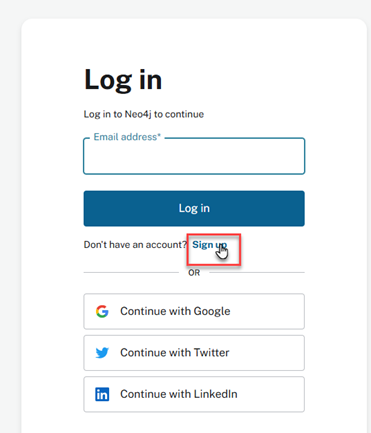
* Als je een Google, Twitter/X of LinkedIn account hebt kan je dat account gebruiken; klik op de bijbehorende link, anders moet je een nieuw account aanmaken; dat moet gekoppeld zijn aan een geldig email-adres. Klik daarvoor op *Sign Up*
* Voer een geldig email-adres in; klik op *Continue*
 
* Voer een wachtwoord in dat voldoet aan de eisen; klik op *Continue*
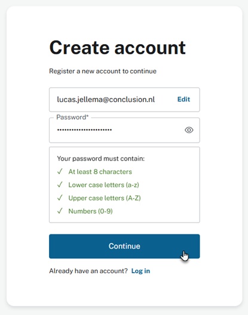
* Accepteer de voorwaarden; druk op *Next*

* Geef je voornaam, achternaam en het land waar je woont; dit hoeven geen geldige gegevens te zijn
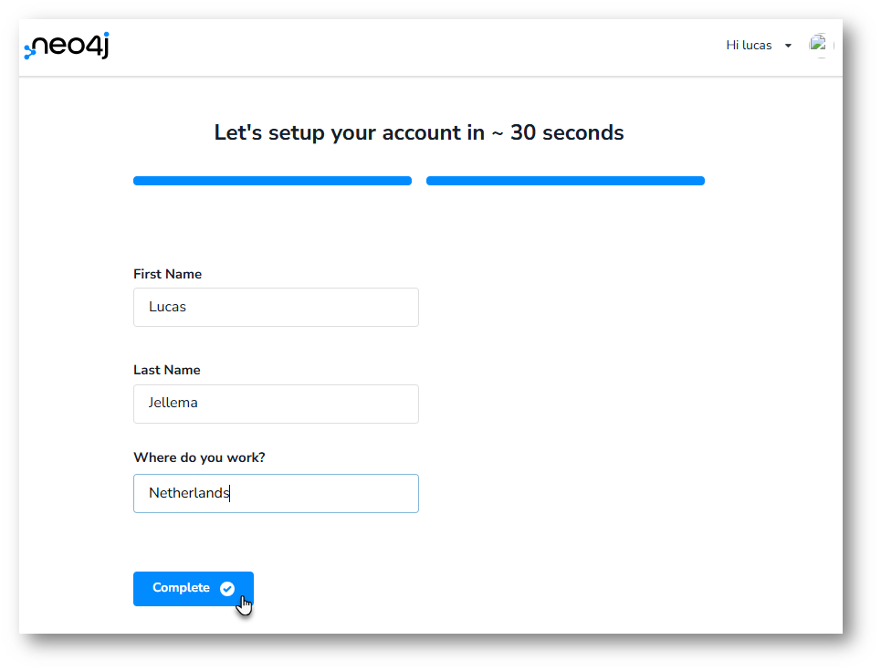
* Er verschijnt nu een boodschap over een verificatie-email. Deze ontvang je op het opgegeven emailadres. Je moet de ontvangst van de mail bevestigen
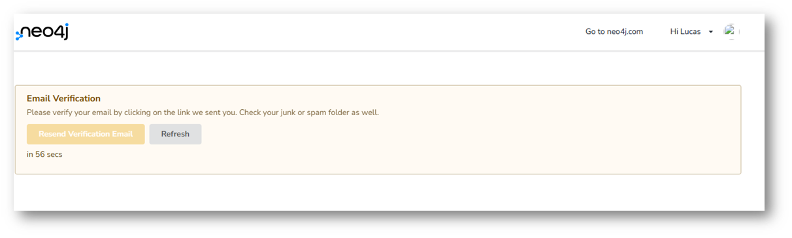

* Ga naar je email client. Je zou een mail van Neo4j moeten ontvangen.
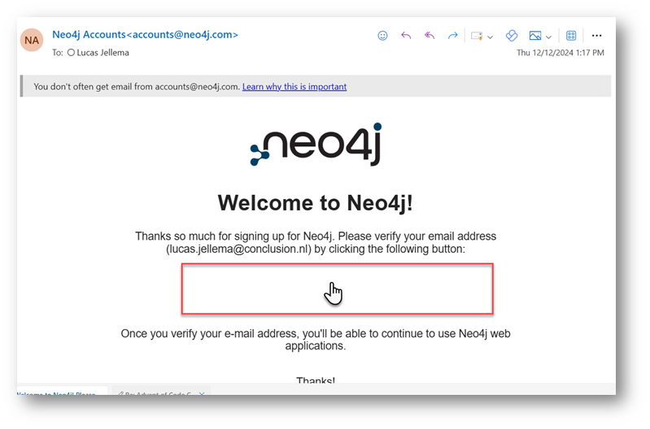
In de mail zou een button of link moeten staan. Ik zag hem niet. Maar op de plek waar hij had moeten staan kon ik klikken (een link activeren). Daarmee heb ik de ontvangst van de email bevestigd.

Een nieuwe webpagina opent met een mededeling over de ontvangst van de email (en daarmee de bevestiging van je emailadres)

Ga terug het browser-venster waar de mededeling stond over de verificatie-mail. Klik op *Refresh*.
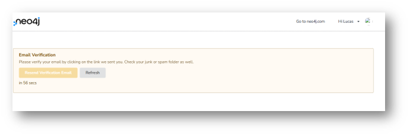
Je komt nu in een scherm waar je een projecttype kan selecteren voor je Neo4j Sandbox:
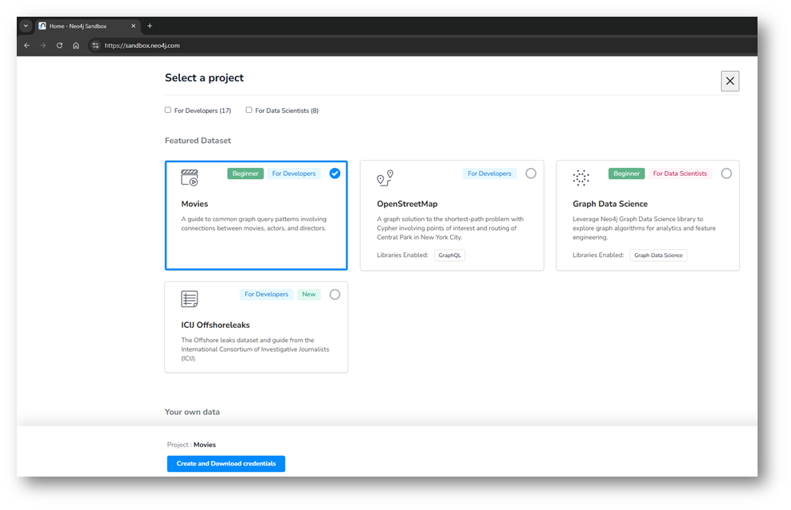
Scroll naar beneden tot je bij *Blank Sandbox* komt. Selecteer deze. Klik dan op de knop *Create and Download Credentials*
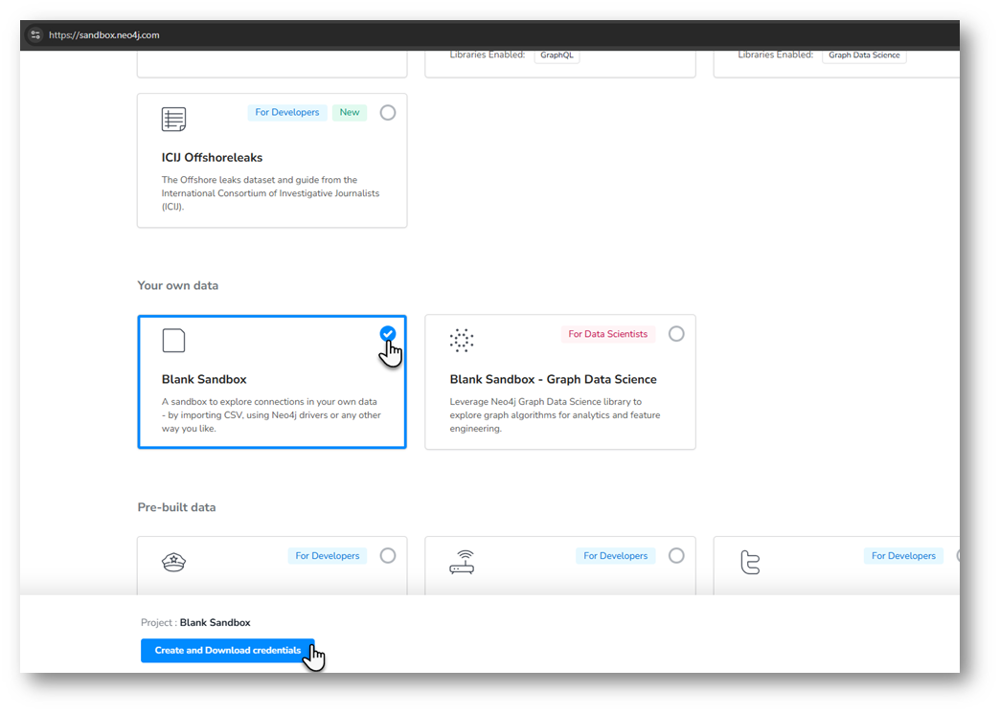
Je ziet een melding over een nieuwe sandbox die wordt gestart:
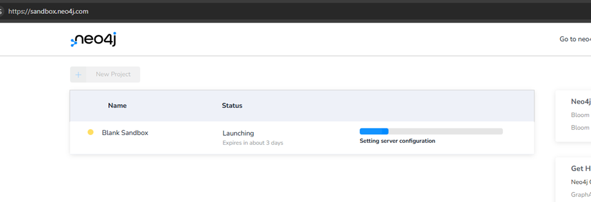
Kort daarna moet je een file downloaden. Je hebt die file verder niet nodig.
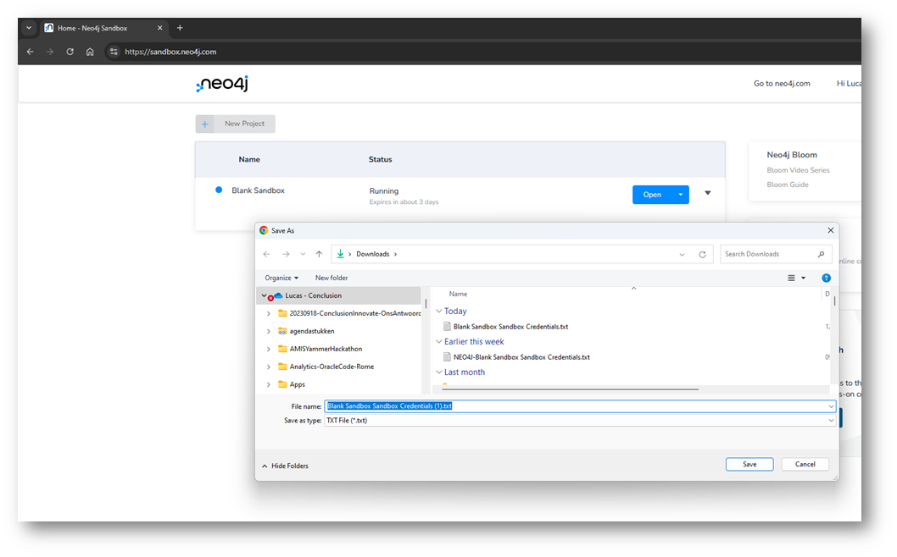
Je krijgt als het goed is nu te zien dat het Sandbox Project de status *Running* heeft. Er is een *Open* knop om de sandbox n de browser te openen. Selecteer die optie:
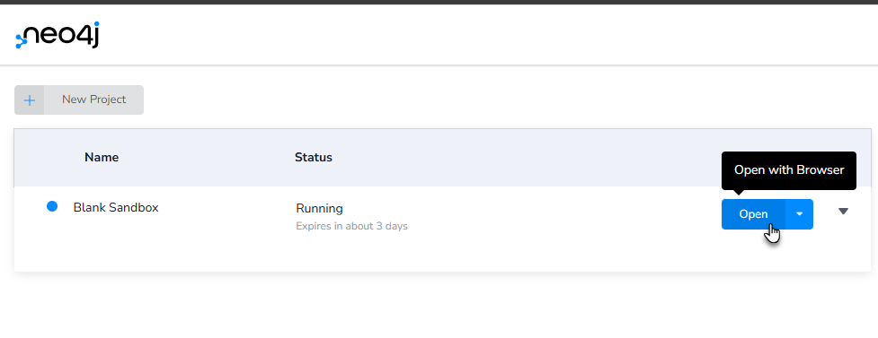
De sandbox wordt geopend. Je kunt eindelijk aan de slag. Eerst nog even de knop *Sandbox Login* indrukken:
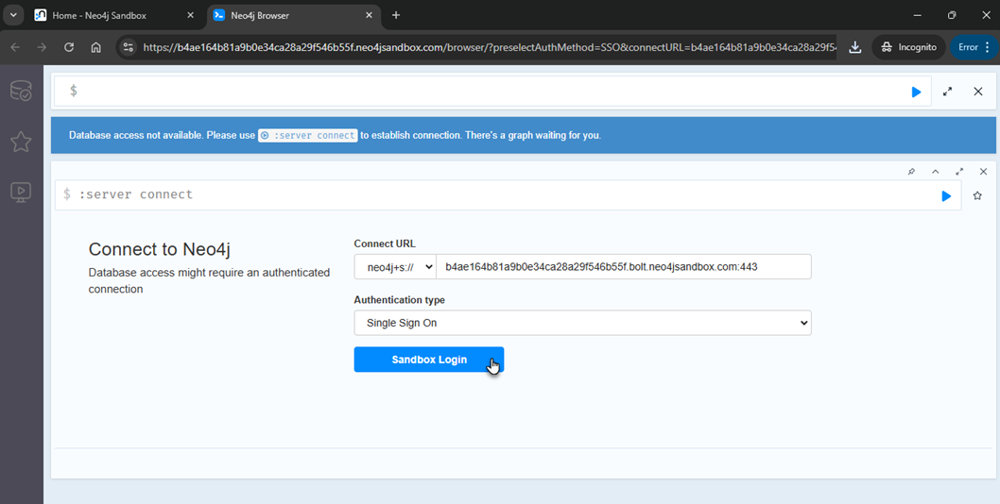

Nu ben je echt klaar om te starten. Je kunt in het bovenste kader een Cypher commando invoeren. Door op de blauwe driehoek te klikken kan je het statement laten uitvoeren. 
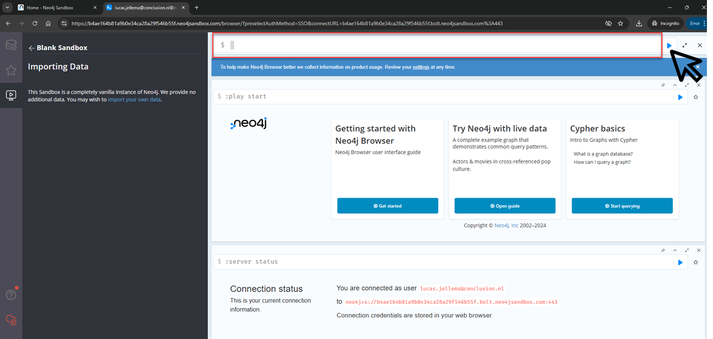

Een voorbeeld statement:
```
MATCH (N) return N;
```
om alle nodes te laten zien. Nu nog geen enkele natuurlijk.

En:
```
CREATE (:School {name: "Griftland College", plaats: "Soest", oprichtingsjaar: 1975, wikipedia:"https://nl.wikipedia.org/wiki/Griftland_College"});
```
Dit statement maakt een nieuwe node aan van het type School met twee eigenschappen.

Doe nu opnieuw:
```
MATCH (N) return N;
```
om de nieuwe node te laten zien.

Dit is zoiets als in SQL `select * from <alle tabellen in de database>`.

Een meer gerichte query zou zijn:
```
MATCH (N:School) return N;
```
(zoiets als `select * from scholen`)

of 

```
MATCH (N:School{plaats:"Soest"}) return N;
```
(zoiets als `select * from scholen where plaats = 'Soest'`)


## Film-liefhebbers en Tips

Gebruik de Cypher statements in file [movie-lovers.cypher](files/movie-lovers.cypher) om nodes en edges aan te maken in de Neo4j database. Deze statements maken drie nodes voor Personen (Alice, Bob, Carol) en vijf films. Ook worden verbindingen gelegd om het enthousiasme van een persoon voor een film aan te geven. 

Bekijk het hele netwerk (Alle nodes en relaties in de database) met:
```
MATCH (m)
RETURN m;
```

Om alleen nodes van het type Movie te bekijken:
```
MATCH (m:Movie)
RETURN m;
```

Welke films vindt Alice leuk? Deze query maakt gebruik van de edges (relaties, connecties) van het type *LOVES* vanaf de Person node voor Alice naar alle nodes van het type Movie.

```
MATCH (p:Person {name: "Alice"})-[:LOVES]->(m:Movie)
RETURN m AS Movie;
```

En welke andere personen vinden de films leuk die Alice leuk vindt? Hier maken we twee keer gebruik van de *LOVES* relatie: eerst van Alice naar movies en dan van movies naar alle personen die die Movie ook leuk vinden:
```
MATCH (alice:Person {name: "Alice"})-[:LOVES]->(movie:Movie)<-[:LOVES]-(other:Person)
RETURN DISTINCT other AS Person;
```

Een heel simpele recommendation engine (zoiets als Netflix tips) kan je beschrijven als "vindt iedereen die dezelfde film(s) leuk vindt als ik, vind de andere films die zij leuk vinden en suggereer de meest populaire daarvan" (heel compact: ik -- houd van => film <= houdt van (zelfde) film -- Persoon --  houdt van => film (en niet <-  haat -- ik))

Deze vraag kunnen we aan Neo4j voorleggen met dit statement:

```
MATCH (alice:Person {name: "Alice"})-[:LOVES]->(movie:Movie)<-[:LOVES]-(other:Person)-[:LOVES]->(otherMovie:Movie)
WHERE movie <> otherMovie
RETURN DISTINCT otherMovie AS Movie;
``` 

Zoek Alice, vindt de films die Alice leuk vindt, zoek de personen die die films leuk vinden en zoek vervolgens de andere films die deze personen leuk vinden. Geef een lijst terug van al die films - met iedere film hooguit één keer in de lijst.

Als Alice aangeeft dat ze eigenlijk ook fan is van *The Matrix* kan dat met dit Cypher statement:
```
MATCH (p:Person {name: "Alice"}), (m:Movie {title:"The Matrix"})
CREATE (p)-[:LOVES]->(m);
``` 

Hierin zoeken we de node met name Alice en de Movie met de titel The Matrix en maken vervolgens de connectie van het type LOVES tussen deze twee nodes.

En we vragen opnieuw om tips voor films die Alice misschien leuk vindt:

```
MATCH (alice:Person {name: "Alice"})-[:LOVES]->(movie:Movie)<-[:LOVES]-(other:Person)-[:LOVES]->(otherMovie:Movie)
WHERE movie <> otherMovie
RETURN DISTINCT otherMovie AS Movie;
```

dan zien we een extra titel verschijnen. Immers: Alice vindt nu *The Matrix* leuk, Carol vindt ook *The Matrix* leuk en die vindt bovendien *The Shawshank Redemption* een goede film. Dat is de extra tip voor Alice.

De meest populaire films kunnen we met dit commando uit Neo4j opvragen:
```
MATCH (:Person)-[:LOVES]->(m:Movie)
RETURN m.title AS Movie, COUNT(*) AS NumberOfLovers
ORDER BY NumberOfLovers DESC;
```

De grootste filmliefhebber - de persoon die over de meeste films een relatie heeft vastgelegd:
```
MATCH (p:Person)-[:LOVES]->(:Movie)
RETURN p.name AS Person, COUNT(*) AS NumberOfMoviesLoved
ORDER BY NumberOfMoviesLoved DESC;
```

De films die helemaal niemand goed vindt:
```
MATCH (m:Movie)
WHERE NOT EXISTS {
    MATCH (:Person)-[:LOVES]->(m)
}
RETURN m AS UnlovedMovie;
```

## Familiegeschiedenis
We hebben het eerder over de stamboom gehad met daarin personen met hun ouders. En we zochten in de grafische weergave van de data naar de oma van Giri. In een kleine dataset kan je dat nog doen in een visuele weergave. Voor grotere data sets of voor automatische verwerking van dat soort data is een Graph Database erg geschikt. Laten we het eens proberen met Neo4j.

Gebruik de statements in de file [files/family-tree.cypher](files/family-tree.cypher) om de database te resetten en dezelfde personen en *kind van* verbindingen aan te maken als we eerder hebben gezien.

Bekijk de resulterende graaf met `match (n) return n;` 

Als we nu willen weten wie de oma is van Giri kunnen we de vraag stellen in Cypher:
```
MATCH (giri:Person {name: "Giri"})-[:CHILD_OF]->(:Person)-[:CHILD_OF]->(grandmother:Person)
RETURN grandmother.name AS Grandmother;
```

of compacter:
```
MATCH (giri:Person {name: "Giri"})-[:CHILD_OF*2..2]->(grandparent:Person)
RETURN grandparent;
```

Als je wilt weten of er ook een overgrootouder in de graph zit (iemand met achterkleinkinderen) kan je dat als volgt vragen:

```
MATCH (:Person)-[:CHILD_OF*3..3]->(overgrootouder:Person)
RETURN overgrootouder;
```
En wie zijn dan de achterkleinkinderen?


```
MATCH (achterkleinkind:Person)-[:CHILD_OF*3..3]->(overgrootouder:Person)
RETURN achterkleinkind, overgrootouder;
```


## Vriendinnen en Stedentrips

Gebruik de inhoud van file [vriendinnen-stadsbezoeken.cypher](files/vriendinnen-stadsbezoeken.cypher) om in de Neo4j browser de nodes aan te maken voor de vriendinnen en de steden die ze hebben bezocht. De edges worden toegevoegd voor de stedentrips - met de data (vanaf en tot).

De graaf in Neo4j ziet er als volgt uit:
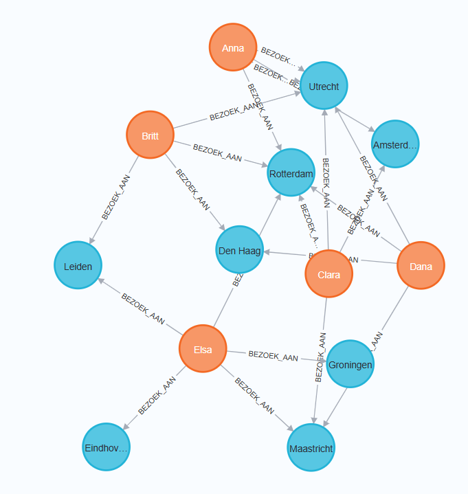

We hadden al eerder gekeken naar de meest populaire stad, met de hand en in de ruwe data of de graafrepresentatie.

Je kunt dat ook met Cypher opvragen uit Neo4j:

```
MATCH (v:Vriendin)-[:BEZOEK_AAN]->(s:Stad)
RETURN s.naam AS Stad, COUNT(*) AS AantalBezoeken, COUNT(distinct v) as AantalUniekeBezoekers
ORDER BY AantalBezoeken DESC;
```

We vragen om alle stadsbezoeken, en tellen dat aantal. Door de naam van de stad te vragen zorgen we automatisch voor een groepering per stad.

Door in plaats van *s.naam AS Stad* te vragen maar in plaats daarvan *v.naam AS Vriendin* krijgen het aantal bezoeken gegroepeerd per vriendin.

Zou een vriendin dezelfde stad meerdere keren hebben bezocht?

Deze query zoekt dat uit: start bij een vriendin node, ga naar alle bezoeken aan steden die zij heeft afgelegd en ga van elke stad langs alle bezoeken die aan die stad zijn gebracht. Bepaal of er een (ander) bezoek is gebracht door dezelfde vriendin als die het eerste bezoek heeft gemaakt. 

```
MATCH (v:Vriendin)-[r1:BEZOEK_AAN]->(s:Stad)<-[r2:BEZOEK_AAN]-(v2:Vriendin)
WITH v.naam AS Vriendin, s.naam AS Stad, r1.vanaf AS StartBezoek1, r2.vanaf AS StartBezoek2
WHERE r1 <> r2 AND v = v2 AND r1.vanaf < r2.vanaf
RETURN Vriendin, Stad, StartBezoek1, StartBezoek2
ORDER BY Vriendin, Stad, StartBezoek1;
```

En ook deze query geeft dat inzicht: bepaal per vriendin alle bezochte steden en tel het aantal bezoeken per stad; als dat groter is dan één dan hebben we een meervoudig  bezoek aan een stad gevonden.
```
MATCH (v:Vriendin)-[r:BEZOEK_AAN]->(s:Stad)
WITH v.naam AS Vriendin, s.naam AS Stad, COUNT(r) AS AantalBezoeken
WHERE AantalBezoeken > 1
RETURN Vriendin, Stad, AantalBezoeken
ORDER BY Vriendin, Stad;
```


Leuk die vriendinnen zo enthousiast op stap zijn geweest. Maar zijn ze wel eens tegelijk in een stad geweest?

Deze query vertelt ons dat verhaal. Vindt voor iedere vriendin alle stedenbezoeken, vindt voor iedere stedentrip de andere bezoeken aan diezelfde stad en kijk of er een overlap is in tijd tussen die andere bezoeken en de stedentrip waar de vraag mee begon.
```
MATCH (v1:Vriendin)-[r1:BEZOEK_AAN]->(s:Stad)<-[r2:BEZOEK_AAN]-(v2:Vriendin)
WHERE v1 <> v2
  AND r1.vanaf <= r2.tot
  AND r1.tot >= r2.vanaf
RETURN v1.naam AS Vriendin1, v2.naam AS Vriendin2, s.naam AS Stad, r1.vanaf AS Vanaf1, r1.tot AS Tot1, r2.vanaf AS Vanaf2, r2.tot AS Tot2
ORDER BY Stad, Vanaf1;
```
De query-toelichting:
*MATCH* 
- v1 en v2 zijn de labels voor twee verschillende vriendinnen. Beide moeten een relatie :BEZOEK_AAN naar dezelfde stad s hebben.
*WHERE* 
- v1 <> v2: Zorgt ervoor dat het niet dezelfde vriendin is.
- r1.vanaf <= r2.tot AND r1.tot >= r2.vanaf: Controleert of de periodes overlappen (inclusief de grenswaarden).
*RETURN*
- Geeft de namen van beide vriendinnen, de stad en de periodes van hun bezoeken terug.
*ORDER BY*
Sorteert het resultaat op stad en de beginperiode van de eerste vriendin. 


## Reisplanner

We zagen eerder al deze matrix met reistijden tussen stations:

Deze matrix bevat de reistijden in minuten tussen verschillende locaties. Iedere reis kan je in beide richtingen maken.

| X   | UC  | UO  | BH  | DD  | SZ  | S   | SD  | B   | A   | HS  | H   |
| --- | --- | --- | --- | --- | --- | --- | --- | --- | --- | --- | --- |
| UC  | X   |     |     |     |     |     |     |     |     |     |     |
| UO  | 4   | X   |     |     |     |     |     |     |     |     |     |
| BH  |     | 5   | X   |     |     |     |     |     |     |     |     |
| DD  |     |     | 3   | X   |     |     |     |     |     |     |     |
| SZ  |     |     |     | 6   | X   |     |     |     |     |     |     |
| S   |     |     |     |     | 2   | X   |     |     |     |     |     |
| SD  |     |     |     |     |     | 3   | X   |     |     |     |     |
| B   |     |     |     |     |     |     | 4   | X   |     |     |     |
| A   | 13  |     |     | 7   |     |     |     |     | X   |     |     |
| HS  |     | 10  |     |     |     |     |     |     |     | X   |     |
| H   |     |     |     |     |     |     |     | 5   | 12  | 3   | X   |

Deze data is ook beschikbaar in Cypher statements, in de file [reisplanner.cypher](files/reisplanner.cypher). Maak in Neo4j met deze Cypher commando's de graaf aan van de stations en de onderlinge reistijden.

Het resultaat ziet er ongeveer zo uit
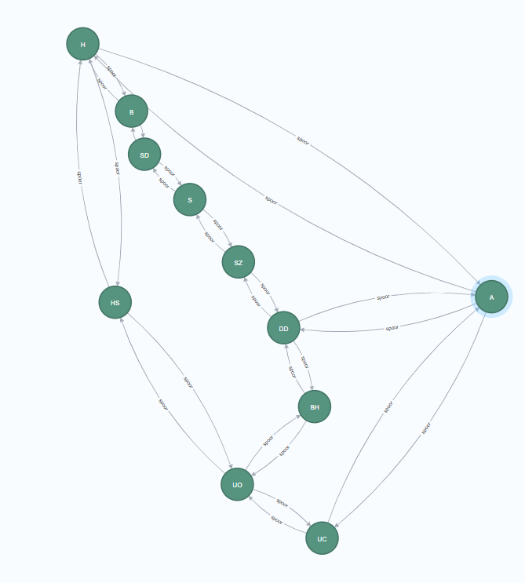

In Neo4j - een connectie gaat één kant op. Omdat de sporen de stations in beide richtingen verbinden zijn alle connecties "dubbel" uitgevoerd - in elke richting een keer.

De mogelijke routes van S(oest) naar UC (Utrecht Centraal) kan je vinden met dit statement:
```
match p = (Soest:Station{name:"S"})-[s:spoor*]->(Utrecht:Station{name:"UC"}) 
WHERE all(x in nodes(p) WHERE single(y in nodes(p) WHERE x = y))
RETURN p 
ORDER BY length(p) 
limit 2;
```
In dit geval beperkt dit commando de set resultaten tot de twee korste routes - geteld in het aantal stations. NB: het uitvoeren van dit command kan enkele tientallen seconden duren.

De kortste route in aantal stations ziet er zo uit:
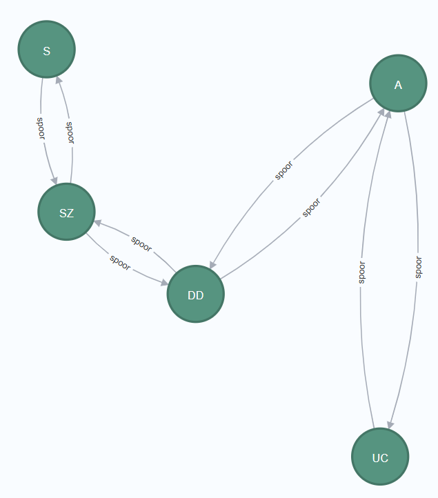

De route B(aarn) => A(mersfoort) zit ten onrechte niet in de tabel. Met die optie zou de kortste route een andere zijn.


De snelste routes - bepaald op basis van reistijd - zien er zo uit:
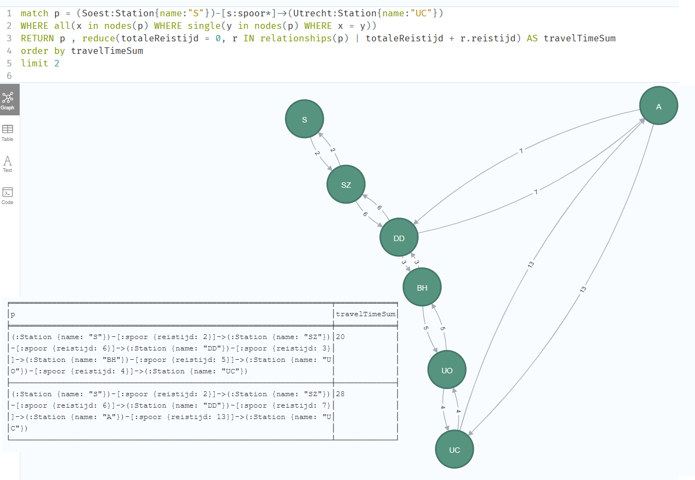

De query waarmee dit is bepaald:
```
match p = (Soest:Station{name:"S"})-[s:spoor*]->(Utrecht:Station{name:"UC"}) 
WHERE all(x in nodes(p) WHERE single(y in nodes(p) WHERE x = y))
RETURN p , reduce(totaleReistijd = 0, r IN relationships(p) | totaleReistijd + r.reistijd) AS totaleReistijd
order by totaleReistijd
limit 2
```

Start op Station S(oest) en vindt de paden via spoorverbindingen naar Station UC (Utrecht Centraal). Zorg dat ieder station maar één keer wordt bezocht (daar zorgt de tweede regel voor). Geef als resultaat alle stations waar je langs komt en ook de totale reistijd via een pad - dat wordt berekend door het *reduce* commando. Sorteer de resultaten op reistijd met de kortste eerst en geef twee resultaten terug.

Je zou kunnen kijken wat er gebeurt met de resultaten als je wel de verbindingen van B(aarn) naar H(ilversum) en A(mersfoort) toevoegt, met behulp van dit Cypher statement:
```
MATCH (B:Station {name: "B"}), (H:Station {name: "H"}), (A:Station {name: "A"})
MERGE (B)-[:spoor {reistijd: 6}]->(H)
MERGE (B)-[:spoor {reistijd: 8}]->(A)
MERGE (H)-[:spoor {reistijd: 6}]->(B)
MERGE (A)-[:spoor {reistijd: 8}]->(B);
```
De korste route in aantal stations dat je passeert vind je hiermee en de route via B(aarn) scoort hoog:
```
match p = (Soest:Station{name:"S"})-[s:spoor*]->(Utrecht:Station{name:"UC"}) 
WHERE all(x in nodes(p) WHERE single(y in nodes(p) WHERE x = y))
RETURN p 
ORDER BY length(p) 
limit 2;
```

Deze route via Baarn is overigens niet korter in reistijd dan gewoon de Sprinter via SZ naar UC. De volgende query laat zien wat de reistijden zijn van routes van S via  B naar UC:
```
MATCH p1 = (start:Station {name: "S"})-[:spoor*..5]->(mid:Station {name: "B"}),
      p2 = (mid)-[:spoor*1..5]->(end:Station {name: "UC"})
RETURN p1, p2,
       reduce(totaleReistijd = 0, r IN (relationships(p1) + relationships(p2)) | totaleReistijd + r.reistijd) AS totaleReistijd
       order by totaleReistijd limit 3;
```
Zo ziet het resultaat van deze query er uit:

```
╒══════════════════════════════════════════════════════════════════════╤══════════════════════════════════════════════════════════════════════╤══════════════╕
│p1                                                                    │p2                                                                    │totaleReistijd│
╞══════════════════════════════════════════════════════════════════════╪══════════════════════════════════════════════════════════════════════╪══════════════╡
│(:Station {name: "S"})-[:spoor {reistijd: 3}]->(:Station {name: "SD"})│(:Station {name: "B"})-[:spoor {reistijd: 8}]->(:Station {name: "A"})-│28            │
│-[:spoor {reistijd: 4}]->(:Station {name: "B"})                       │[:spoor {reistijd: 13}]->(:Station {name: "UC"})                      │              │
├──────────────────────────────────────────────────────────────────────┼──────────────────────────────────────────────────────────────────────┼──────────────┤
│(:Station {name: "S"})-[:spoor {reistijd: 3}]->(:Station {name: "SD"})│(:Station {name: "B"})-[:spoor {reistijd: 5}]->(:Station {name: "H"})-│29            │
│-[:spoor {reistijd: 4}]->(:Station {name: "B"})                       │[:spoor {reistijd: 3}]->(:Station {name: "HS"})-[:spoor {reistijd: 10}│              │
│                                                                      │]->(:Station {name: "UO"})-[:spoor {reistijd: 4}]->(:Station {name: "U│              │
│                                                                      │C"})                                                                  │              │
├──────────────────────────────────────────────────────────────────────┼──────────────────────────────────────────────────────────────────────┼──────────────┤
│(:Station {name: "S"})-[:spoor {reistijd: 3}]->(:Station {name: "SD"})│(:Station {name: "B"})-[:spoor {reistijd: 6}]->(:Station {name: "H"})-│30            │
│-[:spoor {reistijd: 4}]->(:Station {name: "B"})                       │[:spoor {reistijd: 3}]->(:Station {name: "HS"})-[:spoor {reistijd: 10}│              │
│                                                                      │]->(:Station {name: "UO"})-[:spoor {reistijd: 4}]->(:Station {name: "U│              │
│                                                                      │C"})                                                                  │              │
└──────────────────────────────────────────────────────────────────────┴──────────────────────────────────────────────────────────────────────┴──────────────┘
```


## Bonus: Paardensprong

Met de data in de file [files/paardensprong.cypher](files/paardensprong.cypher) kan je een nieuwe graaf aanmaken die een paardensprongpuzzel beschrijft:
```
B A S
E   A
T A D
```

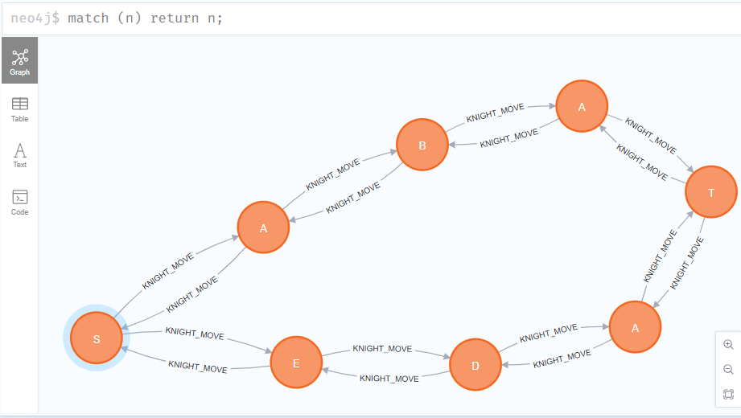

In deze letters zit een woord verstopt. Cypher kan niet het juiste woord vinden maar kan je wel alle mogelijke paden voor deze set letters vertellen. Als je daar dan zelf het juiste woord uit selecteert heb je de puzzel opgelost:

```
MATCH (start:Letter)
CALL apoc.path.expandConfig(start, {
    relationshipFilter: "KNIGHT_MOVE>",
     uniqueness: 'NODE_PATH',
    minLevel: 7,
    maxLevel: 7,
    C3["D"] --> A2
    C3 --> B1
    limit: 100000
}) YIELD path
WITH start.id AS startNode, path, [n IN nodes(path) | n.value] AS letters
RETURN startNode, reduce(word = "", letter IN letters | word + letter) AS word
ORDER BY startNode, word;
```

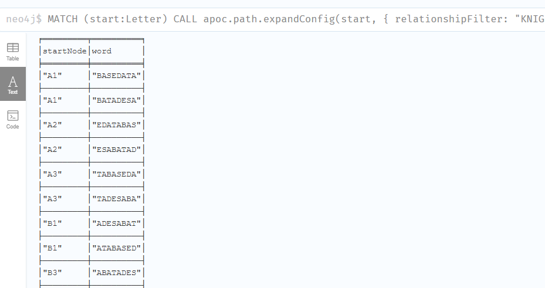